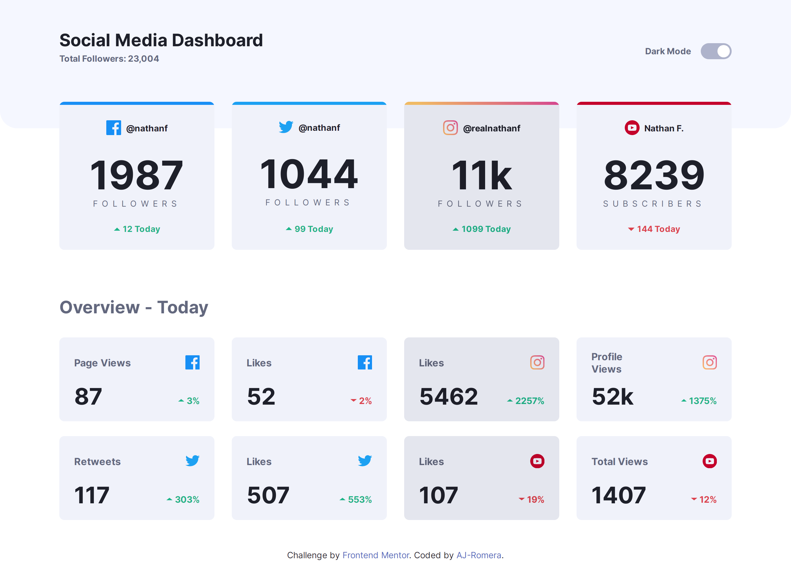
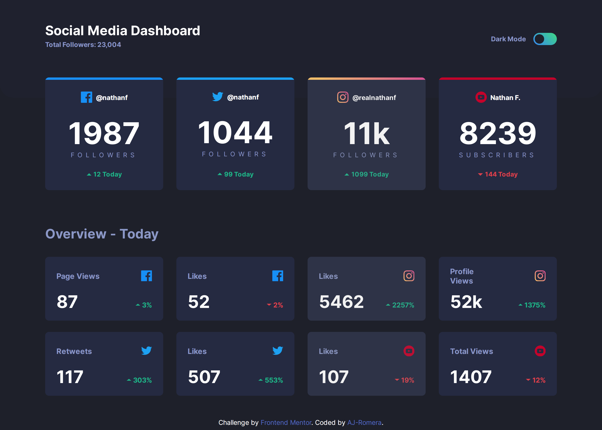
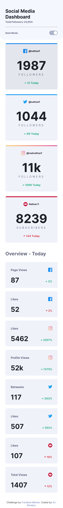
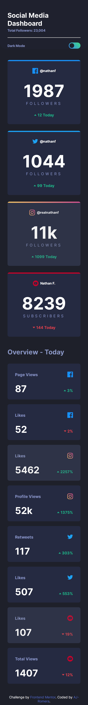

## Table of contents

-   [Overview](#overview)
    -   [The challenge](#the-challenge)
    -   [Screenshot](#screenshot)
    -   [Demo](#demo)
-   [My process](#my-process)
    -   [Built with](#built-with)
-   [Author](#author)

## Overview

### The challenge

This is a challenge from [FrontendMentor](https://www.frontendmentor.io/challenges/social-media-dashboard-with-theme-switcher-6oY8ozp_H). (This is the web if you want to take the challenge or other frontend good challenges)

It consists on building out a social media dashboard with a theme toggle and get it looking as close to the design as possible, using any tool I like. It has to be responsive (at least mobile and desktop)

### Screenshots

### Demo

-   [Demo Web Preview](https://social-dashboard-fm.netlify.app/)

## My process

### Built with

-   Semantic HTML5 markup
-   Vanilla CSS and CSS Variables
-   Javascript for the Toggle Functionality to change Theme Color
-   Flexbox
-   Grid
-   SVGs
-   Mobile-first workflow
-   A ton of love

## Author

-   Linkedin - [AJ-Romera](https://www.linkedin.com/in/aj-romera/)
